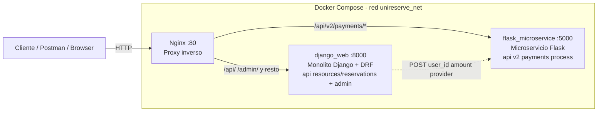

# Migración a Microservicios (Strangler Pattern)

> Página de Wiki — UniReserve · Taller 2 Arquitectura de Software · EAFIT 2026-1

---

## 1. Patrón Strangler Fig aplicado a UniReserve

UniReserve nació como un **monolito Django (DRF)** organizado por capas
(Views API → Services → Domain → Models). A medida que el sistema crece,
ciertos módulos presentan necesidades (escalabilidad, frecuencia de cambio,
dependencias externas) que el monolito ya no resuelve bien.

El patrón **Strangler Fig** (Martin Fowler) propone **no reescribir** el
sistema de golpe, sino **rodear** el monolito con servicios nuevos que poco
a poco absorben sus responsabilidades, hasta que el código viejo muere y se
elimina. La migración es incremental y reversible.

**Aplicado a UniReserve:**

1. Se identifica un módulo candidato con la Matriz de Decisión.
2. Se extrae su lógica a un microservicio independiente (Flask) — ver
   [`flask_microservice/`](../../flask_microservice).
3. Se coloca un **proxy inverso (Nginx)** delante del monolito.
4. El proxy rutea el tráfico nuevo (`/api/v2/payments/*`) al microservicio y
   el resto al monolito DRF.
5. Django solo conserva el **cliente HTTP** (dentro de
   [`apps/reservations/services.py`](../../apps/reservations/services.py),
   en `_process_payment`) — la lógica de cobro ya vive fuera.

---

## 2. Matriz de Decisión

| Módulo                        | Frecuencia de cambio | Consumo de recursos | Acoplamiento con BD | Decisión                        |
|-------------------------------|----------------------|---------------------|---------------------|---------------------------------|
| Crear Reserva                 | Media                | Media               | Alto                | Mantener en Django              |
| Cancelar Reserva              | Baja                 | Baja                | Medio               | Mantener en Django              |
| Historial de Reservas         | Baja                 | Baja                | Medio               | Mantener en Django              |
| **Procesamiento de Pagos**    | **Alta**             | **Alta**            | **Bajo**            | **Estrangular a Flask** ✅      |
| Validación de Disponibilidad  | Media                | Alta                | Medio               | Candidata a futuro              |

---

## 3. Justificación técnica: ¿por qué Procesamiento de Pagos?

- **Alta frecuencia de cambio.** Las pasarelas externas (PSE, Nequi,
  tarjetas) evolucionan mucho más rápido que el núcleo del dominio de
  reservas. Aislarlo evita que cada cambio regrese al ciclo de despliegue
  del monolito.

- **Alto consumo de recursos y riesgo de latencia.** En
  [`apps/reservations/services.py`](../../apps/reservations/services.py)
  el flujo `CreateReservationService.execute` llama sincrónicamente al
  microservicio cuando el recurso es premium
  (`if resource.is_premium: self._process_payment(reservation)`). Si la
  pasarela tarda, se bloquearía un worker del monolito. Externalizarlo
  permite escalarlo y observarlo por separado.

- **Bajo acoplamiento de datos.** El gateway solo necesita `user_id`,
  `user_email`, `amount`, `resource_id` y `payment_provider`; no comparte
  tablas con el resto del dominio. Extraerlo no obliga a migrar base de
  datos.

Los demás módulos comparten tablas (`Reservation`, `Resource`, `Schedule`)
y/o cambian poco, por lo que extraerlos hoy aportaría complejidad sin un
beneficio claro.

---

## 4. Nueva arquitectura (diagrama Mermaid)



**Puntos clave:**

- El **cliente** nunca conoce la topología interna: siempre habla con Nginx
  en el puerto 80.
- **Nginx** decide por ruta a quién despachar.
- El **monolito Django (DRF)** sigue manejando el flujo de reservas, pero
  cuando `resource.is_premium`, `CreateReservationService._process_payment`
  hace un `POST` HTTP al microservicio Flask vía la variable de entorno
  `PAYMENTS_SERVICE_URL` (`http://flask_microservice:5000/api/v2/payments/process`
  dentro de la red Docker).

---

## 5. Contrato del microservicio

`POST /api/v2/payments/process`

**Request body:**
```json
{
  "user_id": 1,
  "user_email": "diego@eafit.edu.co",
  "amount": 25000.00,
  "resource_id": 3,
  "payment_provider": "fake"
}
```

**Respuestas:**
- `200 OK` — pago aprobado (gateway `fake`):
  ```json
  {
    "success": true,
    "transaction_id": "TXN-FAKE-001",
    "amount": 25000.0,
    "user_email": "diego@eafit.edu.co",
    "message": "Payment approved."
  }
  ```
- `402 Payment Required` — pago rechazado (gateway `rejected`):
  ```json
  {
    "success": false,
    "transaction_id": null,
    "message": "Payment rejected by provider."
  }
  ```
- `400 Bad Request` — falta un campo obligatorio o provider no soportado.
- `500 Internal Server Error` — error no controlado.

---

## 6. Snippet del `nginx.conf` explicado

```nginx
upstream django_backend         { server django_web:8000; }
upstream flask_payments_backend { server flask_microservice:5000; }

server {
    listen 80;

    # Microservicio nuevo (Strangler)
    location /api/v2/payments/ {
        proxy_pass http://flask_payments_backend;
    }

    # API legacy explícita (cuando exista una v1 REST formal)
    location /api/v1/ {
        proxy_pass http://django_backend;
    }

    # Fallback: todo lo demás al monolito
    # Incluye /api/resources/, /api/reservations/, /admin/, /
    location / {
        proxy_pass http://django_backend;
    }
}
```

**Lectura línea por línea:**

- `upstream django_backend` / `flask_payments_backend`: Nginx resuelve los
  hostnames `django_web` y `flask_microservice` usando el DNS interno de la
  red Docker definida en [`docker-compose.yml`](../../docker-compose.yml).
  No hay IPs hardcodeadas.
- `location /api/v2/payments/`: la **"rama nueva" del Strangler Fig** —
  todo lo que empiece por esa ruta se desvía al microservicio. Es el único
  lugar donde el tráfico externo toca Flask directamente.
- `location /api/v1/`: marcador para cuando exista un contrato v1 formal
  del monolito. Hoy no hay prefijo v1, pero lo dejamos listo.
- `location /`: fallback. Absorbe `/admin/`, `/api/resources/`,
  `/api/reservations/`, `/api/users/<id>/reservations/` y cualquier otra
  ruta del monolito. Esto garantiza que **ningún flujo viejo se rompa** al
  introducir el proxy.

---

## 7. Impacto esperado en el sistema

### Resiliencia
- El microservicio de pagos se puede reiniciar, desplegar o fallar sin
  tumbar el resto del sistema de reservas.
- Django captura fallos con `PaymentFailedError` y responde HTTP 400 al
  usuario — el flujo degrada, no colapsa.

### Escalabilidad
- Pagos se puede escalar **horizontalmente** (más réplicas del contenedor
  Flask) sin escalar todo el monolito.
- Cada servicio tiene su propio proceso y perfil de carga.

### Aislamiento de fallos
- Una latencia alta de la pasarela externa ya no bloquea workers Django
  sirviendo `/api/reservations/`, `/admin/`, etc.
- Logs y métricas de pagos se separan de los del monolito.

### Evolución independiente
- Pagos puede desplegarse, versionarse y probar nuevas pasarelas **sin
  redeploy** del monolito.
- El contrato entre ambos es un endpoint REST estable
  (`POST /api/v2/payments/process`), no llamadas directas a clases Python.

---

## 8. Setup Inicial

Para poder probar el flujo completo (con pago real al microservicio), se
necesitan datos mínimos en la base de datos de Django.

### 8.1 Levantar todo el sistema
Desde la raíz del repo:
```bash
docker compose up --build
```

Esto levanta:
- `http://localhost` → **Nginx** (puerto 80, punto de entrada único)
- `http://localhost:8000` → Django directo (opcional, bypass Nginx)
- `http://localhost:5000` → Flask directo (opcional, bypass Nginx)

### 8.2 Crear superusuario Django
En otra terminal:
```bash
docker compose exec django_web python manage.py createsuperuser
```

### 8.3 Datos mínimos desde `/admin`
1. Abre `http://localhost/admin/` e inicia sesión con el superusuario.
2. En **Reservations › Users**, crea al menos un usuario (p. ej. con
   `role=student`, `account_status=active`). Guarda su `id`.
3. En **Reservations › Resources**, crea al menos:
   - Un recurso normal (`is_premium=False`) — para probar reservas sin
     pago.
   - Un recurso premium (`is_premium=True`) — **obligatorio** para probar
     el flujo que llega al microservicio Flask (precio fijo definido en
     `ReservationPricingService.PREMIUM_RESOURCE_PRICE = 25000.00`).

### 8.4 Probar el flujo estrangulado (vía Nginx)
```bash
curl -X POST http://localhost/api/reservations/ \
     -H "Content-Type: application/json" \
     -d '{
       "user_id": 1,
       "resource_id": 1,
       "date": "2026-05-01",
       "start_time": "10:00:00",
       "end_time": "11:00:00"
     }'
```

Si el `resource_id` apunta a un recurso premium, Django internamente hace
`POST` a `http://flask_microservice:5000/api/v2/payments/process`. Si el
gateway `fake` aprueba, la reserva queda `confirmed`.

### 8.5 Probar el microservicio de forma aislada
```bash
curl -X POST http://localhost/api/v2/payments/process \
     -H "Content-Type: application/json" \
     -d '{
       "user_id": 1,
       "user_email": "diego@eafit.edu.co",
       "amount": 25000,
       "resource_id": 1,
       "payment_provider": "fake"
     }'
```

Respuesta esperada HTTP 200 con `success: true`.

Para probar rechazo, cambia `payment_provider` a `"rejected"` → HTTP 402.

---

## 9. Qué sigue

- **Validación de Disponibilidad** es el siguiente candidato (alta presión
  bajo carga: se consulta en cada intento de reserva).
- Añadir **circuit breaker** / **retry con backoff** en el cliente HTTP
  dentro de `CreateReservationService._process_payment` para endurecer el
  contrato.
- Observabilidad: exportar métricas Prometheus desde ambos servicios.
